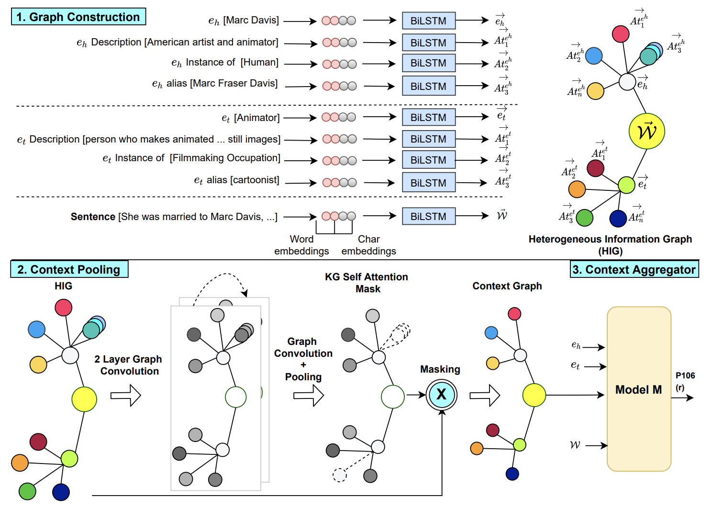

# KGPool: Dynamic Knowledge Graph Context Selection for Relation Extraction

This is an implementation of the paper [KGPool: Dynamic Knowledge Graph Context Selection for Relation
Extraction](https://aclanthology.org/2021.findings-acl.48.pdf), ACL Findings 2021.
```
@inproceedings{nadgeri-etal-2021-kgpool,
    title = "{KGP}ool: Dynamic Knowledge Graph Context Selection for Relation Extraction",
    author = "Nadgeri, Abhishek  and
      Bastos, Anson  and
      Singh, Kuldeep  and
      Mulang{'}, Isaiah Onando  and
      Hoffart, Johannes  and
      Shekarpour, Saeedeh  and
      Saraswat, Vijay",
    booktitle = "Findings of the Association for Computational Linguistics: ACL-IJCNLP 2021",
    month = aug,
    year = "2021",
    address = "Online",
    publisher = "Association for Computational Linguistics",
    url = "https://aclanthology.org/2021.findings-acl.48",
    doi = "10.18653/v1/2021.findings-acl.48",
    pages = "535--548",
}
```



## Acknowledgment

The Code base is built upon the following work - 
- [RECON](https://github.com/ansonb/RECON)
- [GPGNN](https://github.com/thunlp/GP-GNN)
- [SAGPOOL](https://github.com/inyeoplee77/SAGPool)

## Requirements

- Python 3
- torch>=1.8
- torch-geometric>=1.8

## Data
We use the same dataset and the entity attributes as used by the previous baseline [RECON](https://github.com/ansonb/RECON) 

## Usage

First, download the [datasets](https://github.com/ansonb/RECON).


Train and evaluate the model:
<br>
*(make sure Glove embeddings are ready before training)*
```
wget http://nlp.stanford.edu/data/glove.6B.zip
unzip glove.6B.zip
```
Train
```bash
python Context-Aggregator/train.py
```
Testing 
```bash
python Context-Aggregator/test.py
```

### Directory structure

>**Context-Aggregator/**: The same folder strucutre as that of [GPGNN](https://github.com/thunlp/GP-GNN)
>
>**KGPool/data_loader.py**: Data pre-processing and gathering step.
>
>**KGPool/networks.py**: Set the graph architecture.
>
>**KGPool/layers.py**: Perform dynamic pooling on nodes.

## Hyper Parameters
- For Context-Aggregator we use the same hyper-parameters used by the baseline.
- For KGPool we use the defualt params in Context-Aggregator/train.py.
- No systematic hyper-parameter tunning was performed.
